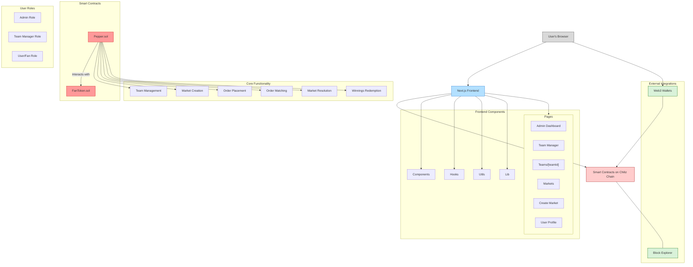

```mermaid
graph TD
    %% Main layers
    Browser["User's Browser"]
    FrontEnd["Next.js Frontend"]
    SmartContracts["Smart Contracts on Chiliz Chain"]
    
    %% Frontend modules
    subgraph "Frontend Components"
        direction LR
        Pages["Pages"]
        Components["Components"]
        Hooks["Hooks"]
        Utils["Utils"]
        Lib["Lib"]
    end
    
    subgraph "Pages"
        direction LR
        Admin["Admin Dashboard"]
        TeamManager["Team Manager"]
        Teams["Teams/[teamId]"]
        Markets["Markets"]
        CreateMarket["Create Market"]
        Profile["User Profile"]
    end
    
    subgraph "Smart Contracts"
        direction LR
        PepperContract["Pepper.sol"]
        FanToken["FanToken.sol"]
    end
    
    %% Connections
    Browser --> FrontEnd
    FrontEnd --> SmartContracts
    
    %% Frontend internal connections
    FrontEnd --> Pages
    FrontEnd --> Components
    FrontEnd --> Hooks
    FrontEnd --> Utils
    FrontEnd --> Lib
    
    %% Smart Contract internal connections
    PepperContract -- "Interacts with" --> FanToken
    
    %% Core functionality
    subgraph "Core Functionality"
        direction LR
        TeamManagement["Team Management"]
        MarketCreation["Market Creation"]
        OrderPlacement["Order Placement"]
        OrderMatching["Order Matching"]
        MarketResolution["Market Resolution"]
        WinningsRedemption["Winnings Redemption"]
    end
    
    PepperContract --> TeamManagement
    PepperContract --> MarketCreation
    PepperContract --> OrderPlacement
    PepperContract --> OrderMatching
    PepperContract --> MarketResolution
    PepperContract --> WinningsRedemption
    
    %% User roles
    subgraph "User Roles"
        direction LR
        AdminRole["Admin Role"]
        TeamManagerRole["Team Manager Role"]
        UserRole["User/Fan Role"]
    end
    
    %% Integrations
    subgraph "External Integrations"
        direction LR
        Wallets["Web3 Wallets"]
        BlockExplorer["Block Explorer"]
    end
    
    Browser --> Wallets
    Wallets --> SmartContracts
    SmartContracts --- BlockExplorer
    
    style FrontEnd fill:#b3e0ff,stroke:#0066cc
    style SmartContracts fill:#ffcccc,stroke:#990000
    style Browser fill:#d9d9d9,stroke:#333333
    style PepperContract fill:#ff9999,stroke:#cc0000
    style FanToken fill:#ff9999,stroke:#cc0000
    style Wallets fill:#d9f2d9,stroke:#006600
    style BlockExplorer fill:#d9f2d9,stroke:#006600
``` 